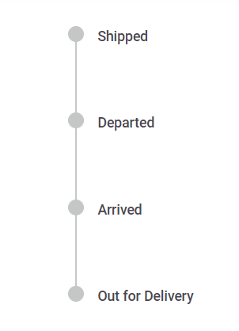
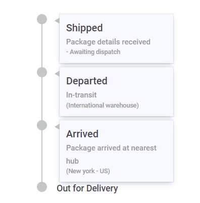
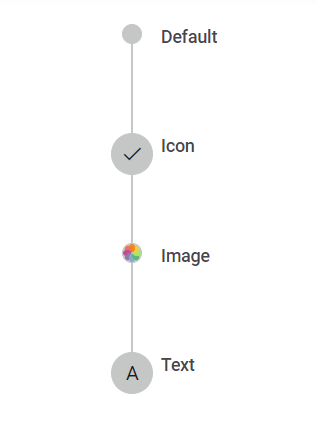
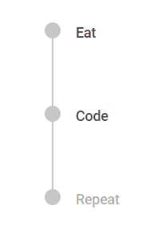

	---
layout: post
title: Items in ##Platform_Name## Timeline Control | Syncfusion
description: Checkout and learn about Items in Syncfusion ##Platform_Name## Timeline control of Syncfusion Essential JS 2 and more.
platform: ej2-asp-core-mvc
control: Items
publishingplatform: ##Platform_Name##
documentation: ug
---

# Items in ##Platform_Name## Timeline control

The Timeline items can be added by using the `items` property. Each item can be configured with options such as `content`, `oppositeContent`, `dotCss`, `disabled` and `cssClass`.

## Adding content

You can define the item content using the `content` property.

### String-based content

You can define string content for the Timeline items.
























### Templated content

You can specify the template content for the items, by using the selector for an element in HTML.
























## Adding opposite content

You can add additional information to each Timeline item, by using the `oppositeContent` property which is positioned opposite to the item content. Similar to the `content` property you can define `string` or `function` as contents to the oppositeContent.
























## Dot item

You can define CSS class to set icons, background colors, or images to personalize the appearance of dots associated with each Timeline item by using the `dotCss` property.

### Adding icons

You can define the CSS class to show the icon for each item using the `dotCss` property.

### Adding images

You can include images for the Timeline items using the `dotCss` property, by setting the CSS `background-image` property.

### Adding text

You can display text for the Timeline items using the `dotCss` property, by adding text to the CSS `content` property.
























## Disabling items

You can use the `disabled` property to disable an item when set to `true`. By default, the value is `false`.
























## CSS class

The `cssClass` property allows you to define a custom class to modify the appearance of the timeline item.